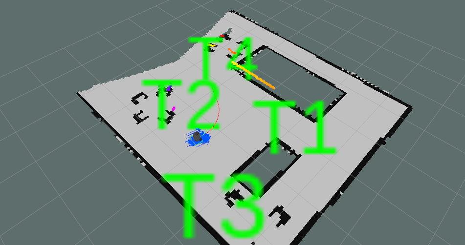

# Robot-waiter
Web controlled Robot-waiter with Turtlebot3 using ROS, Rviz and Gazebo simulator 	

This project is about simulating a robot that serves drinks to tables in a coffee shop
or a bar. For that purpose, I used a Turtlebot3 (Burger) robot.
I achieved this by doing several things:  
Properly configured the ROS navigation stack in the robot in order to make the robot
create a map of the environment. 
Configured the ROS navigation stack to make the robot localize and navigate in the
environment, making use of the previously generated map.  
Created a ROS program that allows to receive the number of a table through a topic,
that would be the table that has requested a drink. 
Then, once the bartender published the table number in the topic using the webpage, the robot would go to that table and wait for
other commands, normally it’s going to be to the barstand or it can be to any other table.

-2019-12-09T00_16_44.551922.jpg)

-2019-12-09T00_15_52.017305.jpg)

